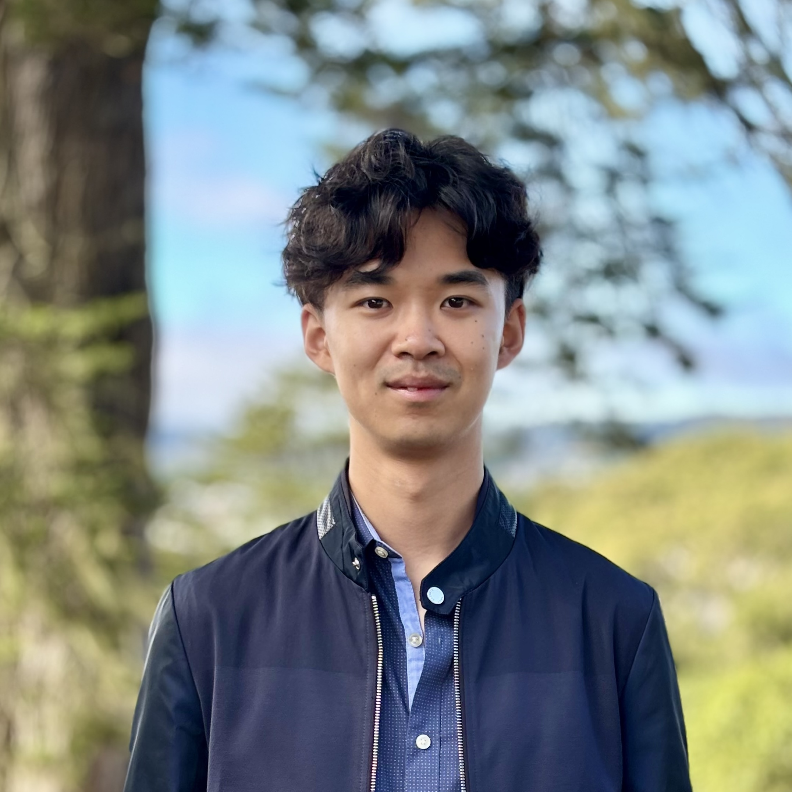

{: .profile-img}

Hi there! Welcome to my home page. I'm Zhiyuan; my friends call me Paul.

I am currently a CS Ph.D. student at [UC Berkeley](https://www.berkeley.edu), advised by professor [Sergey Levine](https://people.eecs.berkeley.edu/~svlevine/). I am interested in reinforcement learning and building autonomous intelligent agents.
I graduated magna cum laude from [Brown University](https://www.brown.edu) with an Sc.B. in Applied Math and Computer Science, where I was advised by professors [George Konidaris](https://cs.brown.edu/people/gdk/) and [Michael Littman](https://www.littmania.com) at Brown. Check out my [research page](/research/) for more information.

Outside of this, I like to jam on my guitar, play badminton, and watch standups and movies.

I love connecting with people. If you'd like to get in contact with me, please reach out at [zhiyuan_zhou at berkeley dot edu].

## Recent News
last updated: Dec 2024
- New paper out on how to do RL fine-tuning without offline data retention! I'm excited to see how [Warm-start RL (WSRL)](http://arxiv.org/abs/2412.07762) can help scale up RL for real-world tasks. Update: WSRL is accepted at ICLR 2025!
- I am thrilled to announce the first big project I led in my Ph.D! Check out [SOAR: Autonomous Improvement of Instruction Following Skills via Foundation Models](https://auto-improvement.github.io). Catch SOAR at CoRL 2024 in Munich! 
- I am going to present my undergrad work [Tiered Reward: Designing Rewards for Specification and Fast Learning of Desired Behavior](/tiered_reward/) at the [RL Conference](https://rl-conference.cc). Come chat with me!
- Check out my undergrad thesis [Policy Transfer in Lifelong Reinforcement Learning through Learning Generalizing Features](https://cs.brown.edu/media/filer_public/c2/72/c272a1f8-1186-4a85-8f97-cfe8a1a7278a/zhouzhiyuan_honors_thesis.pdf).
- I've compiled [some resources](/grad_school_apps/) that helped me during my CS Ph.D. application, along with some of my own thoughts. Hopefully this will be helpful to some others out there!
- I'm honored that our paper [Designing Rewards for Fast Learning](https://arxiv.org/abs/2205.15400?context=cs.AI) is selected for oral presentation at RLDM2022! Check out the [recording](https://brown.hosted.panopto.com/Panopto/Pages/Viewer.aspx?id=7adfa2ab-3dde-46ab-b69e-aea800efe5ef) at 1:20:22.
- Our work [Characterizing the Action-Generalization Gap in Deep Q-Learning](https://arxiv.org/abs/2205.05588) is accepted into RLDM2022!